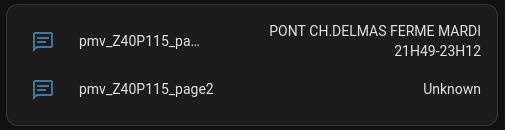

# Home Assistant Integration - Bordeaux Métropole - Panneaux à message variable

Intégration permettant d'afficher le contenu des panneaux à messages variables de Bordeaux Métropole


## Installation

Une clef est nécessaire pour interroger le webservice

[Formulaire de demande de clé](https://data.bordeaux-metropole.fr/opendata/key)



```yaml
sensor:
  - platform: bdx_pmv
    bdx_data_key: !secret bdx_data_key
    bdx_no_data: ""
```

[Exemple dataset](https://opendata.bordeaux-metropole.fr/explore/dataset/pc_pmv_p/table/) pour trouver les ids des panneaux
