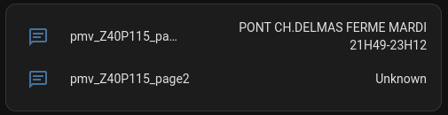

# Home Assistant Integration - Bordeaux Métropole - Panneaux à message variable

Les panneaux à message variable (PMV) de Bordeaux Métropole affichent des informations trafic/circulation. Cette intégration interroge l'API [opendata Bordeaux Métropole](https://opendata.bordeaux-metropole.fr/explore/dataset/pc_pmv_p/table/) pour récupérer le contenu affiché sur un panneau donné et l'exposer dans Home Assistant.

## Installation

Une clé API est nécessaire pour interroger le webservice.

[Formulaire de demande de clé](https://data.bordeaux-metropole.fr/opendata/key)

Ajoutez ensuite l'intégration depuis **Paramètres > Appareils et services > Ajouter une intégration > Bordeaux PMV**, en renseignant la clé et l'identifiant du panneau (ex. `Z40P115`). [Exemple de dataset](https://opendata.bordeaux-metropole.fr/explore/dataset/pc_pmv_p/table/) pour trouver les ids des panneaux.

Le texte affiché par défaut quand une page est vide, ainsi que l'intervalle de rafraîchissement, sont configurables via les options de l'intégration.



## Entités exposées

| Entité | Valeur | Attributs |
|---|---|---|
| `sensor.pmv_<ident>` | Contenu des pages 1 et 2 concaténé (séparé par un retour à la ligne) | `page1`, `page2` |

## Exemples

### Carte Lovelace

```yaml
type: markdown
title: PMV Z40P115
content: >
  {{ states('sensor.pmv_Z40P115') }}
```

### Automatisation : notification sur mot-clé

```yaml
automation:
  - alias: "PMV - Alerte accident"
    trigger:
      - platform: state
        entity_id: sensor.pmv_Z40P115
    condition:
      - condition: template
        value_template: "{{ 'accident' in trigger.to_state.state | lower }}"
    action:
      - service: notify.mobile_app
        data:
          title: "PMV Z40P115"
          message: "{{ trigger.to_state.state }}"
```
